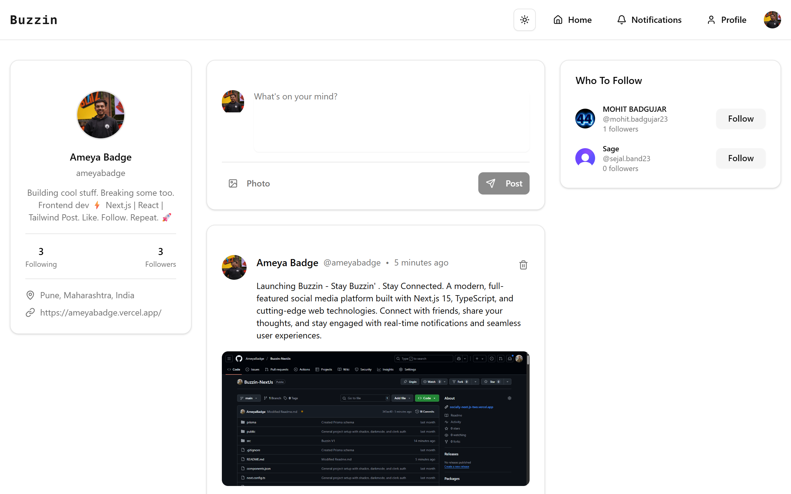
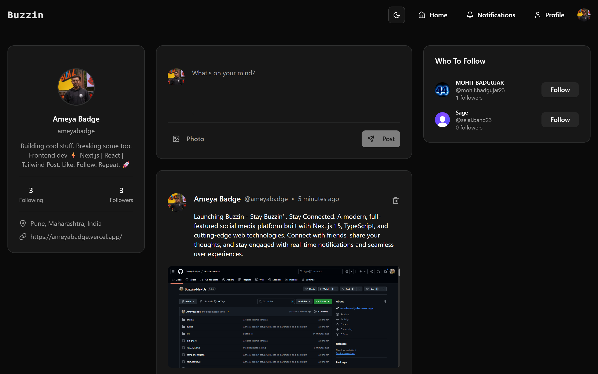
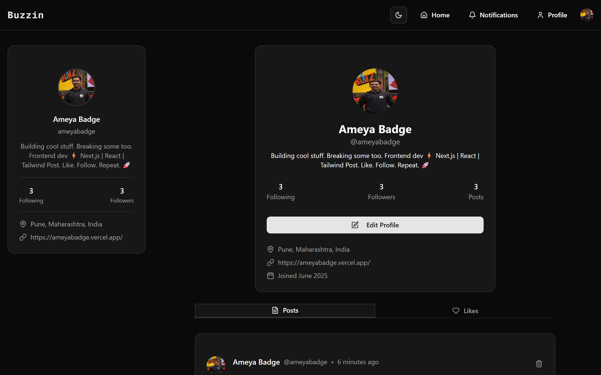
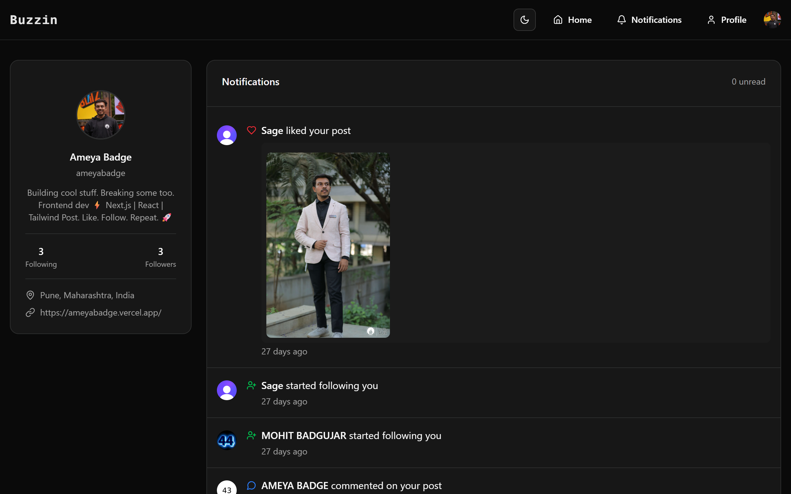

# 🚀 Buzzin


> **Stay Buzzin'. Stay connected** 🐝

A modern, full-featured social media platform built with Next.js 15, TypeScript, and cutting-edge web technologies. Connect with friends, share your thoughts, and stay engaged with real-time notifications and seamless user experiences.

## 🌟 Live Demo

🔗 **[Visit Buzzin Live](https://buzzin-next-js.vercel.app/)**

### 🎥 Demo Video

https://github.com/user-attachments/assets/your-demo-video.mp4

_Quick walkthrough of Buzzin's main features_

---

## 📷 Screenshots

### 🏠 Homepage & Feed

<div align="center">
  
  
</div>

### 👤 User Profiles

<div align="center">
  
</div>

<!-- ### ✍️ Create & Share Posts

<div align="center">
  
</div> -->

### 🔔 Real-time Notifications

<div align="center">
  
</div>

### 📱 Mobile Responsive

<div align="center">
  
</div>

---

## 📖 About The Project

Buzzin is a contemporary social networking platform that brings people together through intuitive design and powerful features. Built with performance and user experience in mind, it offers everything you need for meaningful social interactions.

**What makes Buzzin special:**

- ⚡ Lightning-fast performance with Next.js 15
- 🔐 Secure authentication with Clerk
- 📱 Fully responsive design
- 🌙 Dark/Light theme support
- 🔔 Real-time notifications
- 📸 Image sharing capabilities
- 👥 Social features (follow, like, comment)

---

## 🛠 Tech Stack

### Frontend

- **[Next.js 15](https://nextjs.org/)** - React framework with App Router
- **[React 19](https://react.dev/)** - UI library
- **[TypeScript](https://www.typescriptlang.org/)** - Type safety
- **[Tailwind CSS](https://tailwindcss.com/)** - Utility-first CSS framework
- **[shadcn/ui](https://ui.shadcn.com/)** - Modern UI components
- **[Radix UI](https://www.radix-ui.com/)** - Unstyled, accessible components
- **[Lucide React](https://lucide.dev/)** - Beautiful icons

### Backend & Database

- **[Prisma ORM](https://www.prisma.io/)** - Type-safe database toolkit
- **[PostgreSQL](https://www.postgresql.org/)** - Robust relational database
- **[Neon](https://neon.tech/)** - Serverless PostgreSQL

### Authentication & Services

- **[Clerk](https://clerk.com/)** - Complete authentication solution
- **[UploadThing](https://uploadthing.com/)** - File upload service

### Development Tools

- **[ESLint](https://eslint.org/)** - Code linting
- **[PostCSS](https://postcss.org/)** - CSS processing

---

## ✨ Features

### 🔐 User Management

- **Secure Authentication** - Sign up/login with Clerk
- **User Profiles** - Customizable profiles with bio, location, website
- **Follow System** - Follow/unfollow other users
- **User Suggestions** - Discover new people to connect with

### 📝 Content Creation

- **Post Creation** - Share text and image posts
- **Image Upload** - Seamless image sharing with UploadThing
- **Rich Text Support** - Express yourself with formatted content
- **Post Management** - Edit and delete your posts

### 💬 Social Interactions

- **Like System** - Show appreciation for posts
- **Comments** - Engage in conversations
- **Real-time Notifications** - Stay updated on likes, comments, and follows
- **Activity Feed** - See latest updates from people you follow

### 🎨 User Experience

- **Responsive Design** - Perfect on desktop, tablet, and mobile
- **Dark/Light Theme** - Choose your preferred viewing mode
- **Smooth Animations** - Polished interactions throughout
- **Accessibility** - Built with accessibility best practices

---

## 📁 Project Structure

```
buzzin/
├── 📁 prisma/
│   └── schema.prisma              # Database schema
├── 📁 public/                     # Static assets
├── 📁 src/
│   ├── 📁 actions/                # Server actions
│   │   ├── notification.action.ts
│   │   ├── post.action.ts
│   │   ├── profile.action.ts
│   │   └── user.action.ts
│   ├── 📁 app/                    # Next.js App Router
│   │   ├── layout.tsx             # Root layout
│   │   ├── page.tsx               # Home page
│   │   ├── 📁 api/                # API routes
│   │   ├── 📁 notifications/      # Notifications page
│   │   └── 📁 profile/           # User profiles
│   ├── 📁 components/             # Reusable components
│   │   ├── 📁 ui/                # UI primitives
│   │   ├── CreatePost.tsx
│   │   ├── PostCard.tsx
│   │   ├── Navbar.tsx
│   │   └── ...
│   ├── 📁 lib/                    # Utility libraries
│   │   ├── prisma.ts             # Database client
│   │   ├── uploadthing.ts        # File upload config
│   │   └── utils.ts              # Helper functions
│   └── middleware.ts              # Clerk middleware
├── next.config.ts                 # Next.js configuration
├── tailwind.config.ts             # Tailwind configuration
└── package.json                   # Dependencies
```

---

## 🚀 Getting Started

### Prerequisites

- **Node.js** 18.x or later
- **npm** or **yarn** or **pnpm**
- **PostgreSQL** database (we recommend [Neon](https://neon.tech/))

### Installation

1. **Clone the repository**

   ```bash
   git clone https://github.com/AmeyaBadge/Buzzin-NextJs.git
   cd Buzzin-NextJs
   ```

2. **Install dependencies**

   ```bash
   npm install
   # or
   yarn install
   # or
   pnpm install
   ```

3. **Set up environment variables**

   Create a `.env.local` file in the root directory:

   ```env
   # Database
   DATABASE_URL="your_postgresql_connection_string"

   # Clerk Authentication
   NEXT_PUBLIC_CLERK_PUBLISHABLE_KEY="your_clerk_publishable_key"
   CLERK_SECRET_KEY="your_clerk_secret_key"
   NEXT_PUBLIC_CLERK_SIGN_IN_URL="/sign-in"
   NEXT_PUBLIC_CLERK_SIGN_UP_URL="/sign-up"

   # UploadThing
   UPLOADTHING_SECRET="your_uploadthing_secret"
   UPLOADTHING_APP_ID="your_uploadthing_app_id"
   ```

4. **Set up the database**

   ```bash
   npx prisma generate
   npx prisma db push
   ```

5. **Run the development server**

   ```bash
   npm run dev
   # or
   yarn dev
   # or
   pnpm dev
   ```

6. **Open your browser**

   Navigate to [http://localhost:3000](http://localhost:3000) to see Buzzin in action! 🎉

---

## 📊 Database Schema

Buzzin uses a robust PostgreSQL schema with the following main entities:

### Core Tables

- **Users** - User profiles and authentication data
- **Posts** - User-generated content with text and images
- **Comments** - Threaded discussions on posts
- **Likes** - User engagement tracking
- **Follows** - Social connections between users
- **Notifications** - Real-time activity updates

### Key Relationships

- Users → Posts (One-to-Many)
- Posts → Comments (One-to-Many)
- Users → Follows (Many-to-Many)
- All entities → Notifications (Activity tracking)

---

## 🔮 Roadmap & Future Features

### 🚧 Coming Soon

- [ ] **Real-time Chat** - Direct messaging between users
- [ ] **Stories** - 24-hour disappearing content
- [ ] **Video Posts** - Share video content
- [ ] **Post Scheduling** - Schedule posts for later
- [ ] **Advanced Search** - Find posts, users, and hashtags
- [ ] **Post Bookmarks** - Save posts for later

### 🎯 Future Enhancements

- [ ] **Groups/Communities** - Create and join topic-based communities
- [ ] **User Verification** - Verified user badges
- [ ] **Analytics Dashboard** - Insights for content creators
- [ ] **Mobile App** - React Native mobile application
- [ ] **AI Recommendations** - Smart content discovery
- [ ] **Advanced Privacy Controls** - Granular privacy settings

---

## 🤝 Contributing

We welcome contributions from the community! Here's how you can help:

### How to Contribute

1. **Fork the repository**
2. **Create a feature branch**
   ```bash
   git checkout -b feature/amazing-feature
   ```
3. **Make your changes**
4. **Commit your changes**
   ```bash
   git commit -m 'Add some amazing feature'
   ```
5. **Push to the branch**
   ```bash
   git push origin feature/amazing-feature
   ```
6. **Open a Pull Request**

### Contribution Guidelines

- Follow the existing code style and conventions
- Write clear, descriptive commit messages
- Add tests for new features when applicable
- Update documentation as needed
- Be respectful and constructive in discussions

---

## 🐛 Known Issues & Bug Reports

Currently, there are no major known issues. If you encounter any bugs or have feature requests:

1. **Check existing issues** in the [GitHub Issues](https://github.com/AmeyaBadge/Socially-NextJs/issues)
2. **Create a new issue** with detailed information
3. **Include steps to reproduce** any bugs
4. **Provide system information** (OS, browser, Node.js version)

---

## 👨‍💻 Author

**Ameya Badge**

- GitHub: [@AmeyaBadge](https://github.com/AmeyaBadge)
- Project Link: [https://github.com/AmeyaBadge/Buzzin-NextJs](https://github.com/AmeyaBadge/Buzzin-NextJs)

---

## 📄 License

This project is licensed under the **Apache License 2.0** - see the [LICENSE](LICENSE) file for details.

---

## 🙏 Acknowledgments

- **[Next.js Team](https://nextjs.org/)** - For the amazing React framework
- **[Vercel](https://vercel.com/)** - For seamless deployment
- **[Clerk](https://clerk.com/)** - For robust authentication
- **[Prisma](https://www.prisma.io/)** - For the excellent ORM
- **[shadcn/ui](https://ui.shadcn.com/)** - For beautiful UI components
- **[Tailwind CSS](https://tailwindcss.com/)** - For utility-first styling

---

## ⭐ Show Your Support

If you found this project helpful or interesting, please consider giving it a star! ⭐

**Built with ❤️ by [Ameya Badge](https://github.com/AmeyaBadge)**

---

<div align="center">
  <sub>Stay Buzzin'. Stay connected 🐝</sub>
</div>
